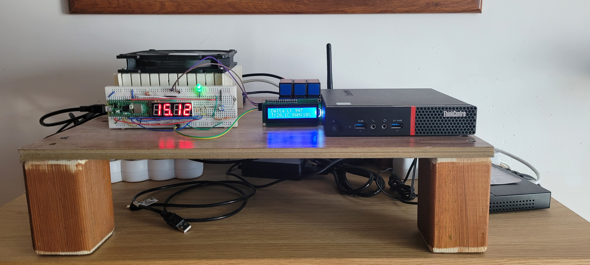
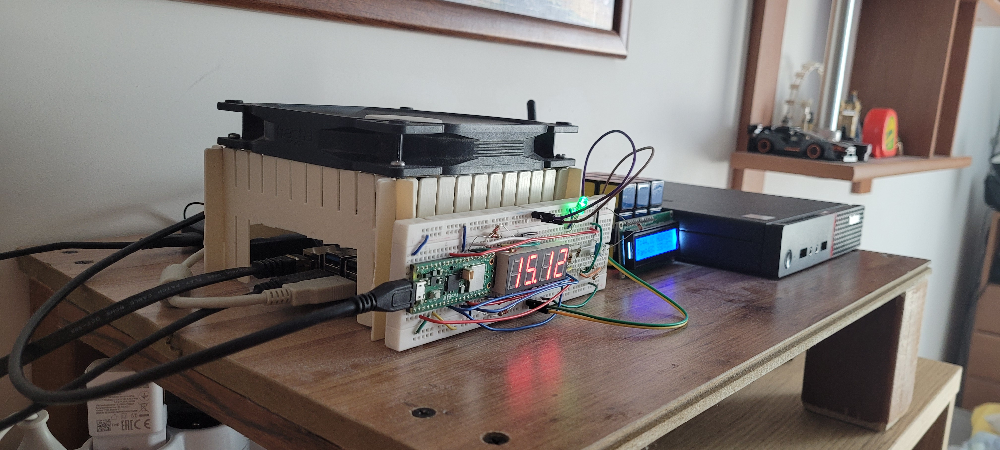
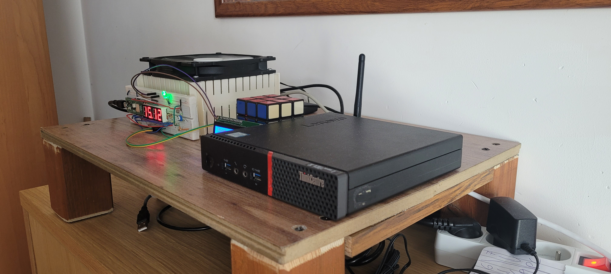
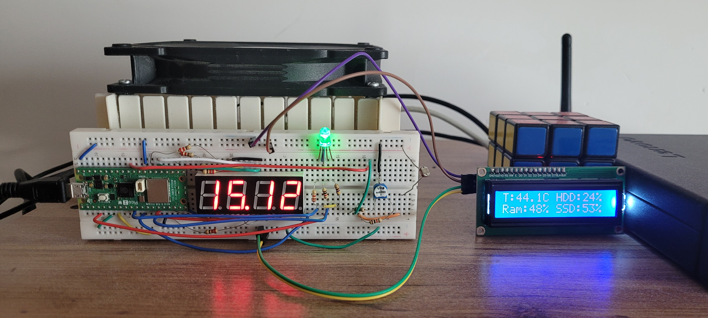

# Secure Edge Homelab

A high-availability, multi-node personal infrastructure project focusing on **Zero-Trust Networking, System Hardening, and Embedded Telemetry**. This repository serves as the technical documentation for my 24/7 hybrid-architecture server environment, scaled from a single-board edge device to a multi-node compute cluster.

## 🛠️ The Hardware Stack

| Component | Node 1 (Control Plane/Edge) | Node 2 (Compute/Worker) |
| :--- | :--- | :--- |
| **Device** | Raspberry Pi 5 (4GB) | Lenovo M700 Tiny |
| **CPU** | Broadcom BCM2712 (4C) | Intel Core i3-6100T (2C/4T) |
| **Storage** | 128GB Kingston NVMe SSD | 220GB Samsung SATA SSD |
| **RAM** | 4GB LPDDR4X | 16GB DDR4 (2x8GB) |
| **Network** | 1Gbps Ethernet (via Switch) | 1Gbps Ethernet (via Switch) |
| **Backup** | 512GB External HDD | Shared via NFS |

**Network Infrastructure:** TP-Link TL-SG108E (8-Port Gigabit Managed Switch) providing isolated traffic segments and 1Gbps low-latency inter-node communication.

*The complete HomeLab ecosystem: Compute nodes, managed networking, and satellite telemetry.*

*The RPI5 node core unit.*

*The RPI5 node with the case fan on top, providing additional cooling and a semi-low-pressure chamber.*

*The M700 node as seen on its own.*

---

## 🔐 Security Architecture (Defense-in-Depth)
As a Master's student in Cybersecurity, I use this lab as a sandbox for implementing and testing enterprise-level security protocols:

*   **Zero-Trust Access:** No ports are exposed to the public internet. All remote management is handled via an encrypted **Tailscale VPN** tunnel.
*   **The HoneyPot ("The Trap"):** A custom-designed Nginx decoy on Port 80. Automated scanning of sensitive directories like `/admin/` triggers an immediate **ntfy.sh** push notification to my mobile device via a custom-built Bash watcher service.
*   **System Hardening:** Current **Lynis Hardening Index: 71**. 
    *   Implemented `Fail2Ban` for SSH protection.
    *   `ClamAV` daemon for real-time malware monitoring.
    *   Automated security patching via `unattended-upgrades`.
*   **Firewall Orchestration:** Strict UFW policies managing traffic between the local LAN, Docker bridges, and the Tailscale interface.

---

## 🤖 DevOps & Monitoring
I follow the "Engineer First" philosophy: if a task is repeatable, it must be automated and monitored.

*   **Cluster Orchestration:** **Docker Swarm** manages container placement, with placement constraints ensuring x86-specific tasks (e.g., VMs, heavy OCR/PDF rendering) run on Node 2.
*   **Monitoring:** **Zabbix** provides full-stack telemetry, monitoring both OS metrics via `zabbix-agent2` and non-agent hardware (Network Switch, Pico 2) via ICMP/HTTP polling.
*   **Automation:** Custom Bash/Python scripts handle orchestrated backups, port audits, and **Wake-on-LAN (WoL)** management for lab workstations.
*   **Visualization:** **Grafana** dashboards visualize everything from personal mood tracking to real-time hardware metrics.
*   **Proactive Alerts:** Thermal health is monitored via **Netdata** with a 70°C ceiling alert (Stable operation @ ~63°C under sustained load).

---

## 📟 Hardware & IoT Integration
The lab extends into physical hardware to provide "at-a-glance" diagnostics and automation:

*   **Pico 2 W Satellite:** An autonomous node (RP2350 - ARM/RISC-V) communicating via **MQTT**, sending alerts via *ntfy* and providing data back to Node 2 via a custom API.
*   **Physical Dashboard:** 
    *   **16x2 I2C LCD:** Displays system uptime, RAM utilization, and thermal delta.
    *   **Multiplexed 7-Segment Display:** NTP-synced server-time clock.
    *   **RGB LED Warning System:** Tri-colour system state indicator (Red=Critical, Blue=Info/Warn, Green=Live).
*   **Print Server:** CUPS implementation for a legacy HP LaserJet P1102 with automated firmware injection.

*Real-time telemetry display module.*

---

## 📁 Repository Structure
- `/docker`: Docker Compose blueprints for the full service stack (Heimdall, Mealie, etc.).
- `/scripts`: Custom Python and Bash tooling for lab management.
- `/pico`: C++ source code for the RP2350 Satellite Node.
- `/docs`: Schematics, security audit logs, and hardware diagrams.
- `/pictures`: Pictures used in readme files through the repository
