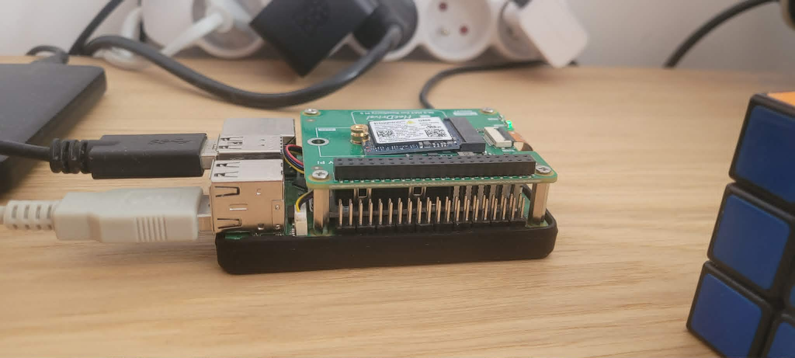
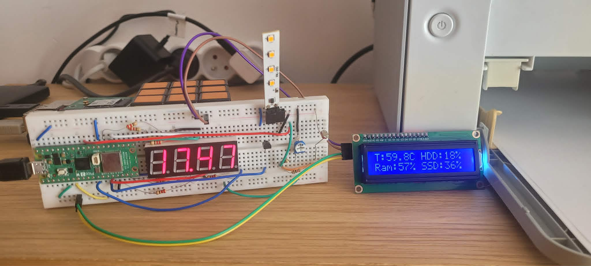
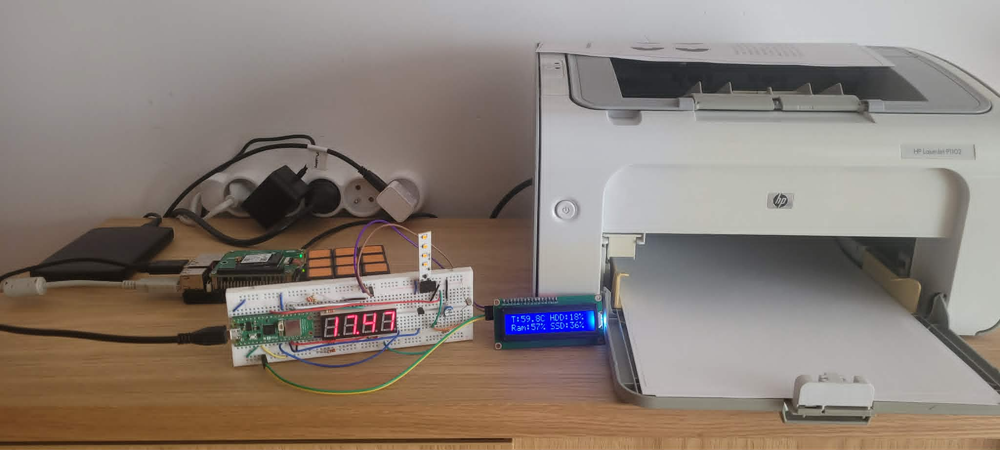

# Secure Edge Homelab (RPi5)

A comprehensive personal infrastructure project focusing on **Zero-Trust Networking, System Hardening, and Embedded Telemetry.** This repository serves as the technical documentation for my 24/7 home-based server environment.

## 🛠️ The Hardware Stack
| Component | Specification |
| :--- | :--- |
| **Compute** | Raspberry Pi 5 (4GB RAM) |
| **Primary Storage** | 128GB Kingston NVMe SSD (PCIe Gen 3 ~867 MB/s) |
| **Backup Storage** | 512GB External HDD |
| **Telemetry Node** | Raspberry Pi Pico 2 W (RP2350) |
| **Cooling** | Official RPi Active Cooler |

*Core unit with high-speed NVMe HAT integration.*

---

## 🔐 Security Architecture (Defense-in-Depth)
As a Master's student in Cybersecurity, I use this lab as a sandbox for implementing and testing enterprise-level security protocols:

*   **Zero-Trust Access:** No ports are exposed to the public internet. All remote management is handled via an encrypted **Tailscale VPN** tunnel.
*   **The HoneyPot ("The Trap"):** A custom-designed Nginx decoy on Port 80. Automated scanning of sensitive directories like `/admin/` triggers an immediate **ntfy.sh** push notification to my mobile device via a custom-built Bash watcher service.
*   **System Hardening:** Current **Lynis Hardening Index: 71**. 
    *   Implemented `Fail2Ban` for SSH protection.
    *   `ClamAV` daemon for real-time malware monitoring.
    *   Automated security patching via `unattended-upgrades`.
*   **Firewall Orchestration:** Strict UFW policies managing traffic between the local LAN, Docker bridges, and the Tailscale interface.

---

## 🤖 DevOps & Monitoring
I follow the "Engineer First" philosophy: if a task is repeatable, it must be automated and monitored.

*   **Automation:** A suite of custom Bash aliases and Python scripts handles daily backups, port audits, and remote wake-up (WoL) for laboratory workstations.
*   **Database Management:** Bare-metal **PostgreSQL** for high-performance data storage, utilized by custom Flask applications.
*   **Visualization:** **Grafana** dashboards visualize everything from personal mood tracking to real-time hardware metrics.
*   **Proactive Alerts:** Thermal health is monitored via **Netdata** with a 70°C ceiling alert (Stable operation @ ~63°C under sustained load).

*Real-time telemetry display showing CPU temp, RAM utilization, and storage health.*

---

## 📟 Hardware & IoT Integration
The lab extends into physical hardware to provide "at-a-glance" diagnostics:

*   **Pico 2 W Satellite:** An autonomous node running C++ on the RP2350 (ARM/RISC-V) that communicates with the Pi 5 via **MQTT**.
*   **Physical Dashboard:** 
    *   **16x2 I2C LCD:** Displays system uptime, RAM usage, and thermal delta.
    *   **Multiplexed 7-Segment Display:** Accurate server-time clock synced via NTP.
    *   **Grave-Light Warning System:** An integrated LED cluster that uses a transistor-switched flicker effect as a physical alarm for system distress.
*   **Print Server:** CUPS implementation for a legacy HP LaserJet P1102 with automated firmware injection.

*The complete HomeLab ecosystem: Compute, Storage, and Satellite Telemetry.*

---

## 📁 Repository Structure
- `/docker`: Docker Compose blueprints for the full service stack (Heimdall, Mealie, etc.).
- `/scripts`: Custom Python and Bash tooling for lab management.
- `/pico`: C++ source code for the RP2350 Satellite Node.
- `/docs`: Schematics, security audit logs, and hardware diagrams.
- `/pictures`: Pictures used in readme files through the repository
