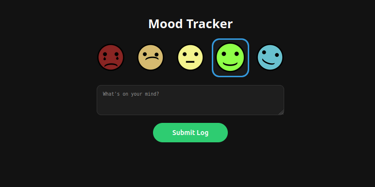

# 📊 Mood Tracker Service

A custom full-stack application designed to log daily emotional data into a centralized PostgreSQL database. This service serves as a primary data source for long-term health and productivity analysis within the HomeLab. Based on previous personal projects :)

## 📱 Frontend Interface
The UI is designed for mobile-first rapid entry via Tailscale. 
- **Interactive Input:** Custom PNG-based buttons with JavaScript state management.
- **Feedback System:** Implements Flask "Flash" messages for database confirmation.

## ⚙️ Technical Workflow
1. **Frontend:** Client selects a mood and adds an optional comment.
2. **Backend:** Flask (Python 3.11) container processes the POST request.
3. **Storage:** Data is persisted to a bare-metal **PostgreSQL** instance via `psycopg2`.
4. **Security:** Use of environment variables for database credentials and parameterized SQL queries to prevent SQL Injection.
5. **Visualization:** The data is pulled by **Grafana** to generate time-series analysis and hourly mood averages.

## 📦 Deployment
This service is containerized and deployed via **Dockge**. It uses `network_mode: host` to communicate directly with the local PostgreSQL instance at the highest possible performance.